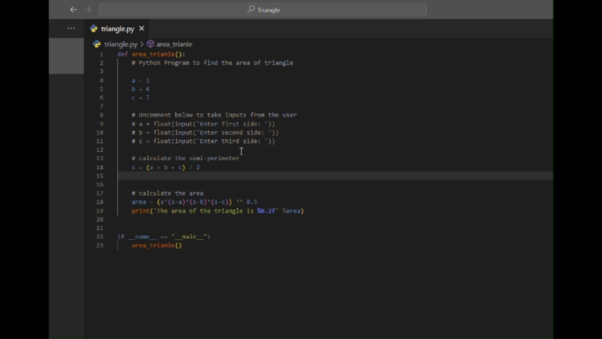

# Codeclip

Codeclip is an extension which can be used as a clipboard in Visual Studio Code. But keep this in your mind, this is not an ordinary clipboard.

## How you can use this extension ?

- Press <kbd>Ctrl</kbd> + <kbd>c</kbd> to copy value ( Just normal copy ) and Press <kbd>Ctrl</kbd> + <kbd>b</kbd> to move copied value to Codeclip ( In mac press <kbd>Cmd</kbd> + <kbd>c</kbd> and <kbd>Cmd</kbd> + <kbd>b</kbd> )

- Press <kbd>Ctrl</kbd> + <kbd>l</kbd> to list all the copied values ( In mac press <kbd>Cmd</kbd> + <kbd>l</kbd> )

- Click on one option that you want to paste it on editor or you can copy that value using copy button which appears in each option.

- Press <kbd>Ctrl</kbd> + <kbd>d</kbd> to delete all the values in Codeclip ( In mac press <kbd>Cmd</kbd> + <kbd>d</kbd> )

## Features in advance

- By pressing <kbd>Ctrl</kbd> + <kbd>C</kbd> and <kbd>Ctrl</kbd> + <kbd>B</kbd> you can move copied values to codeclip.

- By pressing <kbd>Ctrl</kbd> + <kbd>l</kbd> or <kbd>Cmd</kbd> + <kbd>l</kbd> you can list down all the values.

- By clicking on perticular option you can paste it down to the editor.

- You can view clipboard values one by one

git a

- You can delete clipboard values one by one

## What can this extension do ?

> You can move any string value to Codeclip (As an example you can move copied code from ChatGPT to Codeclip)

> Search any copied value.

> Delete all the values on Codeclip.

> Delete value one by one.

> Copy values one by one from Codeclip .

> View each Codeclip value.

> You can clip 10 values on Codeclip.

## Requirements

> Visual Studio Code version must be higher than 1.85.1
